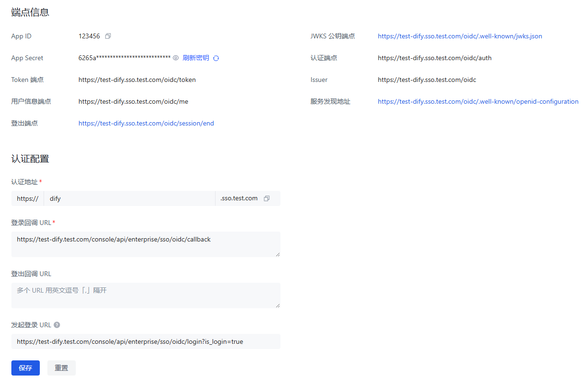

# Dify SSO 集成

这个项目实现了 Dify 的企业 SSO 集成，当前支持 OIDC 协议。

## 功能特性

- OIDC 登录集成
- 配置灵活，通过环境变量控制
- 支持授权码流程
- 支持用户数据库自动创建和关联

## 技术栈

- Python 3.8+
- FastAPI
- SQLAlchemy
- PostgreSQL
- Redis
- Flask-Login

## 系统要求

- Python 3.8 或更高版本
- PostgreSQL 12 或更高版本
- Redis 6 或更高版本
- 支持 OIDC 的身份提供商

## 项目结构

```
dify-sso/
├── app/                      # 主应用代码
│   ├── api/                  # API 路由和端点
│   ├── core/                 # 核心配置和功能
│   ├── db/                   # 数据库模型和迁移
│   ├── models/               # 数据模型
│   ├── services/             # 业务逻辑服务
│   ├── utils/                # 工具函数
│   ├── __init__.py           # 包初始化文件
│   └── main.py               # 应用入口文件
├── assets/                   # 静态资源和图片
├── yaml/                     # 部署配置文件
│   ├── docker-compose.yaml   # Docker Compose 配置
│   └── k8s-deployment.yaml   # Kubernetes 部署配置
├── .env.example              # 环境变量示例
├── .env                      # 环境变量配置
├── .dockerignore             # Docker 忽略文件
├── .gitignore                # Git 忽略文件
├── requirements.txt          # 项目依赖
└── Dockerfile                # Docker 构建文件
```

## 配置说明

OIDC SSO 集成需要以下环境变量配置：

```bash
# Dify 配置
CONSOLE_WEB_URL=your-dify-web-address  # dify 的 web 地址
SECRET_KEY=your-secret-key  # dify 的 secret key
TENANT_ID=your-tenant-id  # dify 的 tenant id
EDITION=SELF_HOSTED

# 令牌配置
ACCESS_TOKEN_EXPIRE_MINUTES=600
REFRESH_TOKEN_EXPIRE_DAYS=30
REFRESH_TOKEN_PREFIX=refresh_token:
ACCOUNT_REFRESH_TOKEN_PREFIX=account_refresh_token:

# OIDC配置
OIDC_ENABLED=true  # 是否启用OIDC
OIDC_CLIENT_ID=your-client-id  # OIDC客户端ID
OIDC_CLIENT_SECRET=your-client-secret  # OIDC客户端密钥
OIDC_DISCOVERY_URL=https://your-oidc-provider/.well-known/openid-configuration  # OIDC发现端点
OIDC_REDIRECT_URI=http://localhost:8000/enterprise/sso/oidc/callback  # 回调URI
OIDC_SCOPE=openid profile email  # 请求的范围
OIDC_RESPONSE_TYPE=code  # 响应类型

# 数据库配置
DB_HOST=127.0.0.1
DB_PORT=5432
DB_DATABASE=dify
DB_USERNAME=dify_admin
DB_PASSWORD=123456

# Redis配置
REDIS_HOST=127.0.0.1
REDIS_PORT=6379
REDIS_DB=0
REDIS_PASSWORD=  # Redis密码，如无密码则留空
```

## 安装与运行

### 使用 Docker

1. 构建镜像：

```bash
docker build -t dify-sso .
```

2. 运行容器：

```bash
docker run -p 8000:8000 --env-file .env dify-sso
```

### 本地开发

1. 克隆仓库：

```bash
git clone https://github.com/lework/dify-sso.git
cd dify-sso
```

2. 创建并激活虚拟环境：

```bash
python -m venv .venv
source .venv/bin/activate  # Linux/Mac
.venv\Scripts\activate     # Windows
```

3. 安装依赖：

```bash
pip install -r requirements.txt
```

4. 配置环境变量：

```bash
cp .env.example .env
# 编辑.env文件，设置您的OIDC配置和数据库配置
```

5. 运行应用：

```bash
python -m app.main
```

### 接入流程

1. 创建 sso 服务商



2. 启动 dify-sso 容器

```bash
docker run -p 8000:8000 --env-file .env lework/dify-sso:0.0.1
```

3. 在 dify-proxy 的 nginx 配置文件中添加以下配置：

```nginx
location ~ (/console/api/system-features|/console/api/enterprise/sso/) {
  proxy_pass http://dify-sso:8000;
  include proxy.conf;
}
```

> nginx 完整的配置看[default.conf.template](https://github.com/langgenius/dify/blob/main/docker/nginx/conf.d/default.conf.template)

如果 dify-proxy 是部署在 k8s 中。 可使用 [k8s-deployment.yaml](./yaml/k8s-deployment.yaml) 文件部署 dify-sso 。

如果 dify-proxy 是部署在 docker 中。 可使用 [docker-compose.yaml](./yaml/docker-compose.yaml) 文件部署 dify-sso 。

## API 端点

OIDC SSO 集成提供以下 API 端点：

- **GET /console/api/enterprise/sso/oidc/login**: 启动 OIDC 登录流程，将用户重定向到 OIDC 提供商
- **GET /console/api/enterprise/sso/oidc/callback**: OIDC 回调处理，处理授权码并获取用户信息
- **GET /console/api/system-features**: 获取系统功能配置
- **GET /health**: 健康检查端点
- **GET /info**: 获取企业信息

## OIDC 认证流程

OIDC 登录流程遵循标准的授权码流程（Authorization Code Flow）：

1. 用户访问 `/console/api/enterprise/sso/oidc/login` 端点
2. 系统生成授权 URL，重定向用户到 OIDC 提供商的登录页面
3. 用户在 OIDC 提供商处认证
4. OIDC 提供商将用户重定向回 `/console/api/enterprise/sso/oidc/callback`，带有授权码
5. 系统使用授权码获取访问令牌和 ID 令牌
6. 系统使用访问令牌获取用户信息
7. 系统通过 OIDC 用户信息中的 `sub` 或 `email` 查询数据库，确认用户是否存在：
   - 如果用户存在，更新其信息（如姓名）并记录登录时间和 IP
   - 如果用户不存在，创建新用户并关联到默认租户
8. 系统生成 JWT 令牌和刷新令牌，并将用户重定向到 Dify 控制台

## 数据库表说明

系统使用以下主要表格：

- `accounts`: 存储用户账号信息
- `tenants`: 存储租户信息
- `tenant_account_joins`: 存储用户与租户的关联

## 贡献指南

1. Fork 本仓库
2. 创建特性分支 (`git checkout -b feature/AmazingFeature`)
3. 提交更改 (`git commit -m 'Add some AmazingFeature'`)
4. 推送到分支 (`git push origin feature/AmazingFeature`)
5. 创建 Pull Request

## 许可证

本项目采用 MIT 许可证 - 详见 [LICENSE](LICENSE) 文件

